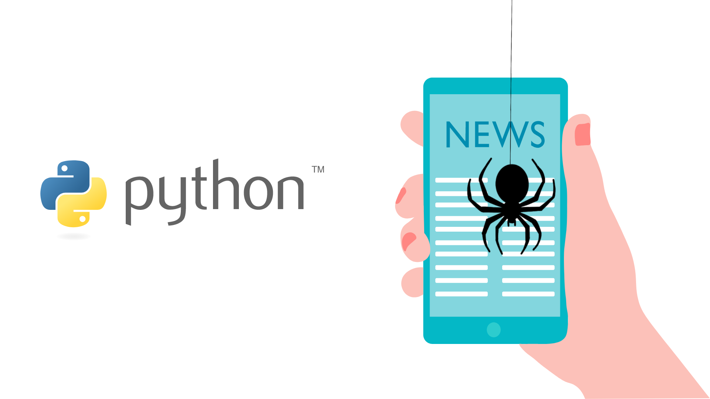
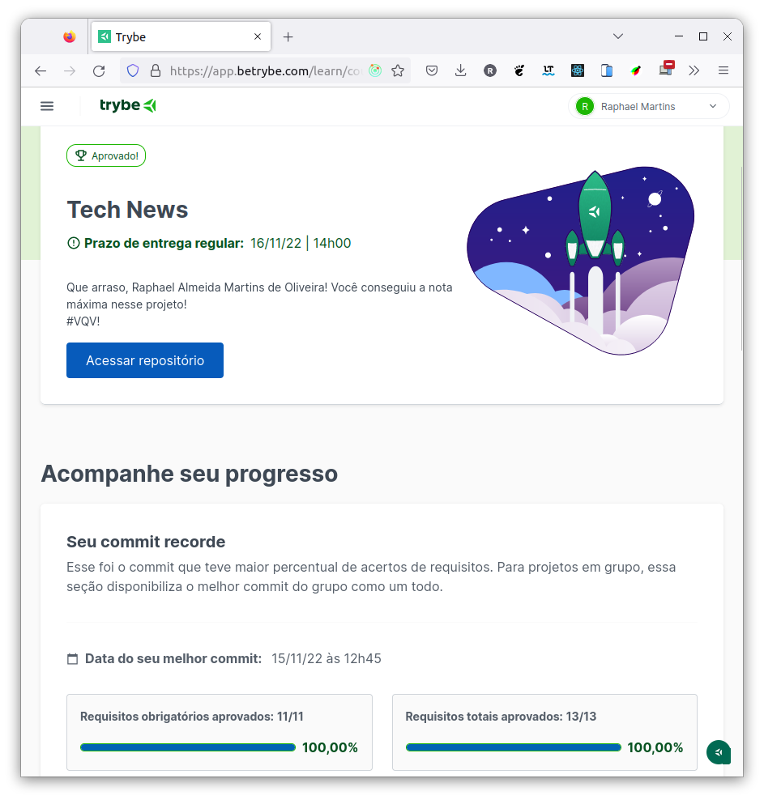

# :snake: Python Tech News :newspaper: :spider:

## :page_with_curl: About/Sobre

  
<strong>:us: English</strong>
 

Python data science project developed by [Raphael Martins](https://www.linkedin.com/in/raphaelameidamartins/) at the end of Unit 35 ([Computer Science Module](https://github.com/raphaelalmeidamartins/trybe_exercicios/tree/main/4_Ciencia-da-Computa%C3%A7%C3%A3o)) of Trybe's Web Development course. I was approved with 100% of the mandatory and optional requirements met.

We had to develop a cralwer to scrape news data from Trybe's blog.
 

  
<strong>:brazil: Português</strong>
 

Projeto de Python e ciência de dados desenvolvido por [Raphael Martins](https://www.linkedin.com/in/raphaelameidamartins/) ao final do Bloco 35 ([Módulo Ciência da Computação](https://github.com/raphaelalmeidamartins/trybe_exercicios/tree/main/4_Ciencia-da-Computa%C3%A7%C3%A3o)) do curso de Desenvolvimento Web da Trybe. Fui aprovado com 100% dos requisitos obrigatórios e opcionais atingidos.

Tivemos que desenvolver um cralwer para raspar dados de notícias do blog da Trybe.
 

## :man_technologist: Developed Skills/Habilidades Desenvolvidas

  
<strong>:us: English</strong>
 

* Use Python's interactive terminal
* Write your own modules and import them into other code
* Apply data scraping techniques
* Extract data from HTML content
* Store the obtained data in a database
 

  
<strong>:brazil: Português</strong>
 

* Utilizar o terminal interativo do Python
* Escrever seus próprios módulos e importá-los em outros códigos
* Aplicar técnicas de raspagem de dados
* Extrair dados de conteúdo HTML
* Armazenar os dados obtidos em um banco de dados

 

## :hammer_and_wrench: Tools/Ferramentas

* Python
* Pytest

## :trophy: Grade/Nota

